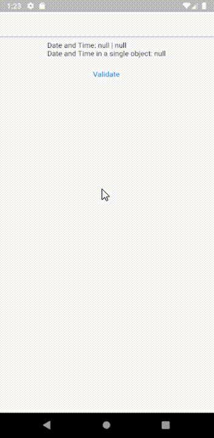

# date_time_picker_form_field
Date and Time picker that uses Futters FormField and Decoration.

## Demo



## Status

🚧 In Construction 🚧

## Usage
add a line like this to your package's pubspec.yaml (and run an implicit flutter pub get)
```yaml
dependencies:
  date_time_picker_form_field: 
    git:
      url: https://github.com/LeonardoJRibeiro/date_time_picker_form_field
```


## Example

```dart
import 'package:date_time_picker_form_field/date_time_picker_form_field.dart';
import 'package:flutter/material.dart';

void main() {
  runApp(Example());
}

class Example extends StatefulWidget {
  const Example({Key? key}) : super(key: key);
  @override
  _ExampleState createState() => _ExampleState();
}

class _ExampleState extends State<Example> {
  final dateTimeController = DateTimePickerController();
  final formKey = GlobalKey<FormState>();
  Widget build(BuildContext context) {
    return MaterialApp(
      debugShowCheckedModeBanner: false,
      title: 'Date Timer Picker Form Field Demo',
      theme: ThemeData(
        primarySwatch: Colors.blue,
      ),
      home: Scaffold(
        body: SafeArea(
          child: Form(
            key: formKey,
            child: Column(
              children: [
                DateTimePickerFormField(
                  firstDate: DateTime.now()
                      .subtract(const Duration(days: 356, hours: 6)),
                  lastDate:
                      DateTime.now().add(const Duration(days: 356, hours: 6)),
                  controller: dateTimeController,
                  validator: (date) {
                    if (date == null) {
                      return 'This is a required field!';
                    }
                    if (date.isBefore(DateTime.now())) {
                      return 'Must be now or after than now!';
                    }
                  },
                ),
                Padding(
                  padding: const EdgeInsets.all(8.0),
                  child: ValueListenableBuilder<DateTimePickerValues>(
                    valueListenable: dateTimeController,
                    builder: (context, value, child) => Text(
                        'Date and Time: ${dateTimeController.value.date} | ${dateTimeController.value.time}\nDate and Time in a single object: ${dateTimeController.dateAndTime}'),
                  ),
                ),
                TextButton(
                  onPressed: () {
                    formKey.currentState?.validate();
                  },
                  child: const Text('Validate'),
                ),
              ],
            ),
          ),
        ),
      ),
    );
  }
}
```


## Todo:
-  [ ] accept only date or time on picker, currently it work with both
-  [ ] write documentation
-  [ ] tests


